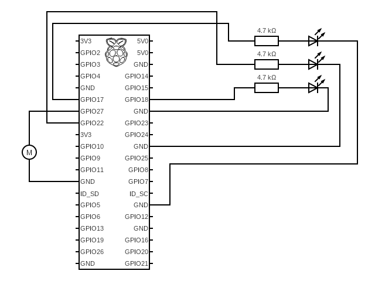

# PiHome 🏠

A Gesture based Smart Home Automation System powered by a Raspberry Pi that enables users to control household appliances through intuitive hand gestures.


## 🚀 Features


- **Hand Gesture Recognition**: Detects and classifies hand gestures using MediaPipe and a custom-trained model.
- **Smart Home Integration**: Controls household appliances based on recognized gestures.
- **Flask API**: Provides an HTTP endpoint for processing images and returning gesture classifications.
- **Raspberry Pi Compatible**: Designed to run seamlessly on a Raspberry Pi for IoT applications.

## ✅ Prerequisites

Before getting started, ensure the following:

#### On the Raspberry Pi:

- A functioning Raspberry Pi with Raspberry Pi OS installed
- Webcam or Raspberry Pi Camera Module connected and enabled
    * If you have a legacy camera use the `raspistill` command to capture images
    * Otherwise use the `libcamera-still` command.

- Network connectivity with access to the server

#### On the Server:

- A computer or cloud instance to run the Flask server
- Network accessibility from the Raspberry Pi
## 🛠️ Installation Steps:

1. Clone this Repository

```
git clone https://github.com/amanamitabh/PiHome
```

2. Move the **`pi/`** directory onto your Raspberry Pi.

3. Create a `.env` file in the **`pi/`** directory with the following content:

```
SERVER_NAME=<YOUR_SERVER_HOSTNAME_OR_IP>
```

4. Install the required packages on your Raspberry Pi:

```
sudo apt update
sudo apt install python3-pi
pip3 install requests python-dotenv
```

5. Copy the **`server/`** folder to your server machine.

6. Install the dependencies from the `requirements.txt` file:

```
pip install -r requirements.txt
```

7. Create a `.env` file in the **`server/`** folder with the following content:

```
PORT=<PORT_NUMBER>
```

8. Run the python scripts on the server and the Raspberry Pi:
For the Server:
```
cd server
python3 server.py
```

For Raspberry Pi:
```
cd pi
python3 client.py
```
## 🧩 Hardware Setup

### Components Used

- Raspberry Pi 3B
- Raspberry Pi Camera Module or any Webcam
- Breadboard
- LEDs
- DC Motor (Fan)
- External Power Source
- Relay Module
- Wires


### GPIO Pin Connections

The Raspberry Pi GPIO (General Purpose Input/Output) pins allow the Pi to interact with external components like LEDs, sensors, and motors. 


Refer to the circuit diagram given below to connect the components to your Raspberry Pi. 

**DO NOT CONNECT THE MOTOR DIRECTLY TO THE RASPBERRY PI. USE AN EXTERNAL POWER SOURCE ALONG WITH A RELAY MODULE CONTROLLED BY THE PI TO PREVENT OVERLOADING WHICH CAN DAMAGE YOUR RASPBERRY PI.**




## ⚙️ How It Works?

#### 📷 Image Capture
The Raspberry Pi captures an image using the connected camera at regular intervals.

#### 🌐 Uploading to the Server
The captured image is sent via HTTP POST to a [Flask](https://flask.palletsprojects.com/en/stable/) server.

#### 🧠 Processing the Image
The server uses [MediaPipe Hands](https://ai.google.dev/edge/mediapipe/solutions/guide) to extract hand landmarks. The coordinates of the extracted landmarks are passed to a Multilayer Perceptron (MLP) model which classifies the hand gestures.


#### 📬 Response Handling
The server responds with the name of the detected gesture (`Open`, `Close`, `OK`, `Pointer` or `None`).

#### 🔌 Device Triggering
The Raspberry Pi triggers the corresponding device based on the server's response.

| Gesture   | BCM Pin | Device |
| -------- | ------- | ------- |
| Open  | GPIO 17 | LED 1 |
| OK | GPIO 18 | LED 2 |
| Pointer | GPIO 27 | Fan |
| Close | GPIO 22 | LED 3 |

## 💐 Acknowledgements

Special thanks to [Kazuhito00](https://github.com/Kazuhito00) for the `Keypoint_Classifier` model from [hand-gesture-recognition-using-mediapipe
](https://github.com/Kazuhito00/hand-gesture-recognition-using-mediapipe).

 

## 🪪 License

**PiHome** is licensed under [Apache 2.0](https://www.apache.org/licenses/LICENSE-2.0)
